# High-Intensity Circuit Training Using Body Weight: Maximum Results With Minimal Investment

**Brett Klika**, C.S.C.S., B.S. and **Chris Jordan**, M.S., C.S.C.S., NSCA-CPT, ACSM HFS/APT

_ACSM's Health & Fitness Journal_ 17(3):8–13, May/June 2013 — DOI:
[10.1249/FIT.0b013e31828cb1e8](https://doi.org/10.1249/FIT.0b013e31828cb1e8)

**Key words:** Circuit Training, High-Intensity Interval Training, Body Weight Training, Fat Loss, V̇O₂max Improvement

## Learning Objective

To understand the health benefits and practical application of a high-intensity circuit training exercise protocol.

## Introduction

At the Human Performance Institute, Division of Wellness and Prevention, Inc., in Orlando, FL, our clients are
high-performing professionals from a variety of industries. These men and women face incessant demands on their time,
along with the pressure to perform at high levels and balance their careers and personal lives.

From our work with elite performers, we have learned that managing energy is the key to sustaining high performance.
However, when facing seemingly infinite demands, one's ability to manage and expand physical energy can be severely
compromised. This can result in persistent fatigue (physical, but also emotional and mental) and a growing level of
disengagement with one's career, family, friends, and personal well-being, which can ultimately lead to performance
failure.

Regular aerobic and resistance training are two of the strategies we suggest to help individuals manage and expand their
physical energy, prevent fatigue, and sustain engagement in those things that really matter to them. For either of these
exercise strategies to be practical and applicable to the time-constrained client, they must be safe, effective, and
efficient. As many of our clients travel frequently, the program also must be able to be performed anywhere, without
special equipment.

Traditionally, resistance training often is performed separately from aerobic training — typically on two or three
nonconsecutive days each week. The American College of Sports Medicine (ACSM) recommends 8 to 12 repetitions of a
resistance training exercise for each major muscle group at an intensity of 40% to 80% of a one-repetition max (RM)
depending on the training level of the participant. Two to three minutes of rest is recommended between exercise sets to
allow for proper recovery. Two to four sets are recommended for each muscle group (3).

Standard guidelines for aerobic training recommend 150 minutes per week of moderate-intensity exercise (46% to 63% of
maximal oxygen uptake, V̇O₂max) for 30 to 60 minutes per session and/or 75 minutes per week of vigorous-intensity
exercise (64% to 90% V̇O₂max) for 20 to 60 minutes per session (3).

Although these traditional protocols can be effective, they may not be realistic enough for time-conscious adults
because of the amount of time necessary to complete each program, in addition to some limitations to effectiveness
demonstrated in the literature (12, 15).

To address the limitations of traditional exercise protocols and provide an effective and efficient program for our
clients, one of the exercise strategies we use is high-intensity circuit training (HICT) using body weight as
resistance. Our approach combines aerobic and resistance training into a single exercise bout lasting approximately 7
minutes. Participants can repeat the 7-minute bout 2 to 3 times, depending on the amount of time they have. As body
weight provides the only form of resistance, the program can be done anywhere.

HICT is not a new concept, but it is growing in popularity because of its efficiency and practicality for a
time-constrained society. The combination of aerobic and resistance training in a high-intensity, limited-rest design
can deliver numerous health benefits in much less time than traditional programs (5, 9, 10, 16, 18). When body weight is
used as resistance, it eliminates the limiting factors of access to equipment and facilities.

As this programming modality is applied to a growing number of populations, it is important to understand the benefits,
methodologies, and supporting research with regard to HICT.

## Brief History

Elements of circuit-style training programs were present early on in history. The modern form of circuit training was
developed by R.E. Morgan and G.T. Anderson in 1953 at the University of Leeds in England (8). It was initially examined
as a 9 to 12 exercise protocol where participants performed exercises at a moderate intensity (about 40% to 60% of 1 RM
values) for a specified number of repetitions or amount of time. Once the repetitions were performed or time expired,
the participant would move to the next exercise station with very little rest. Improvements in muscle strength and
endurance were observed, as well as components of aerobic fitness (8). The efficiency of this type of training grew in
popularity and expanded because of advances in equipment by the United States (selectorized and hydraulic equipment).

For years, a growing body of research expanded on the benefits of this highly efficient mode of training. Researchers
have examined how increasing the intensity of this type of training by using exercises known to significantly elevate
the heart rate and limiting rest time could elicit even greater gains in even shorter overall exercise time (4, 5, 10,
16).

Today, using body weight as resistance during circuit training may grow in popularity as financial means to special
equipment and facilities access have declined for some. Body weight can provide an adequate training load as long as it
results in sufficient aerobic and resistance training intensities.

## HICT for Fat/Weight Loss

HICT can be a fast and efficient way to lose excess body weight and body fat (5, 12, 17, 18). The incorporated
resistance training contributes significantly to the amount of fat burned during a workout (15). When resistance
training exercises using multiple large muscles are used with very little rest between sets, they can elicit aerobic and
metabolic benefits (2, 6, 12). Research has found that these metabolic benefits can be present for up to 72 hours after
a high-intensity exercise bout has been completed (7).

There also may be a greater impact on subcutaneous fat loss with high-intensity intermittent circuit-style resistance
training protocols than with traditional steady state sustained-effort aerobic work or traditional resistance training.
This is thought to be from the increased level of catecholamines and growth hormone found in the blood both during and
after high-intensity resistance training exercise with shortened rest periods (<30 seconds) (11, 12).

Shorter rest periods result in a shorter total exercise time. This is attractive to individuals who are trying to
maximize the impact of an exercise program in minimal time.

## HICT May Improve Markers of Health

HICT may be an extremely effective and efficient means by which to increase an individual's V̇O₂max, a well-established
marker of cardiopulmonary health. When HICT protocols have been compared with traditional steady state protocols in the
laboratory, HICT elicits similar and sometimes greater gains in V̇O₂max, despite significantly lower exercise volume (5,
10, 16).

HICT can be an efficient approach to decreasing insulin resistance as well — a major factor in developing type 2
diabetes. Positive changes have been observed in insulin resistance in as little as 8 minutes per week when executed at
an intensity more than 100% V̇O₂max (14).

## Designing an Effective HICT Program

### Contraindications

Because of the elevated demand for exercise intensity in HICT protocols, caution should be taken when prescribing this
protocol to individuals who are overweight/obese, detrained, previously injured, or elderly or for individuals with
comorbidities. For individuals with hypertension or heart disease, the isometric exercises (wall sit, plank, and side
plank) are not recommended. The isometric exercises can be substituted with dynamic exercises. For all individuals, the
Valsalva maneuver should be avoided, particularly for the isometric exercises. Proper execution requires a willing and
able participant who can handle a great degree of discomfort for a relatively short duration. It is also essential that
participants in an HICT understand proper exercise form and technique. As with all exercise programs, prior medical
clearance from a physician is recommended.

Although HICT can be an efficient means by which to improve health and decrease body fat, it may be inferior to creating
absolute strength and power, specific endurance, and other specific performance variables (3). If these are the goals of
a program, as with competitive athletes, traditional programs may elicit greater absolute gains.

### Exercise Selection

The exercises selected for an HICT circuit should function to:

1. promote strength development for all major muscle groups of the body
2. use large muscle groups to create the appropriate resistance and aerobic intensity
3. create a balance of strength throughout the body (_e.g._, you would not want to prescribe five exercises for one body
   part while only prescribing one for another; creating a balance of strength around a joint is an effective way to
   prevent injury and improve movement efficiency (1))
4. be immediately modified or adapted as necessary to increase or decrease exercise intensity
5. be safe and appropriate for the participants in the training space provided
6. be interactive with the available features of the training environment (_e.g._, stairs, benches, walls, etc.)
7. be easily transitioned to accommodate minimized rest time

### Exercise Order

Exercises in an HICT circuit should be placed in an order that allows for opposing muscle groups to alternate between
resting and working in subsequent exercise stations. For example, a push-up (upper body) station would be followed by a
squat (lower body) station. While the participant is performing push-ups, the lower body is not being used significantly
and can somewhat recover. This allows for the lower body to have sufficient energy to perform squats with proper form
and technique and at adequate intensity.

If a particular exercise creates a significant increase in heart rate or intensity demand (usually dynamic exercises
incorporating the lower body or whole body), the next exercise functions to decrease heart rate or intensity slightly.
For example, a stationary plank or abdominal crunches may follow jumping squats.

The objective is to allow for a series of exercises to be performed in quick succession — using proper form and
technique — and at high intensity with minimal rest between exercises.

### Number of Exercises

The original circuit training protocols called for 9 to 12 exercise stations. There is no ideal number of exercise
stations; however, it is important that, for a general program, all muscles are used at an appropriate intensity during
a training session. The number of exercise stations also will affect the total exercise time.

### Individual Exercise Bout Time

Generally, the longer the exercise duration, the lower the exercise intensity that can be accomplished. To maximize the
metabolic impact of the exercise, time should be sufficient enough to allow for the proper execution of 15 to 20
repetitions (15) of an exercise.

A 30-second exercise bout is adequate to allow for this because most participants are able to acquire and maintain
appropriate intensity for 30 seconds. Participants can assess absolute intensity by monitoring their heart rate either
manually or with a heart rate monitor during exercise.

### Rest Between Exercise Bouts

When rest intervals are too long during HICT, it undermines the purpose of the high-intensity protocol, which is to
create maximal exercise intensity in minimal time. To maximize benefits of this type of training, 30 seconds of rest or
less has been observed to maximize metabolic impact (6). Overall, the objective is for incomplete recovery between
exercises so the high exercise intensity can be sustained for the short duration circuit, without compromising proper
exercise form and technique.

For maximum time efficiency, we recommend minimizing (≤15 seconds) rest time between body weight exercises in an HICT
protocol to maintain appropriate exercise intensity.

### Total Exercise Time

Research has demonstrated that improvements can be made in V̇O₂max and insulin sensitivity in as little as 4 minutes of
total exercise time in an HICT session (4, 16). However, it is to be noted that this result often requires working at
intensities equivalent to greater than 100% of V̇O₂max (16).

More moderate protocols (90% to 100% of V̇O₂max) have been examined for various total exercise durations (4). Although
these protocols seem to require slightly more total exercise time to be effective, they still are well below the steady
state exercise time requirements.

Because most individuals may not be able to execute the program at an intensity significantly greater than 100% of their
V̇O₂max, following the established ACSM guidelines for high-intensity exercise of at least 20 minutes is recommended (3).
This may require multiple repetitions (or circuits) of a multistation exercise circuit.

## HICT Sample Program

The following is an example of a 12-station HICT program. All exercises can be done with body weight and implements
easily acquired in almost any setting (_e.g._, home, office, hotel room, etc.). The exercise order allows for a total
body exercise to significantly increase the heart rate while the lower, upper, and core exercises function to maintain
the increased heart rate while developing strength.

Exercises are performed for 30 seconds, with 10 seconds of transition time between bouts. Total time for the entire
circuit workout is approximately 7 minutes. The circuit can be repeated 2 to 3 times.

|   # | Exercise                    | Body area  |
| --: | --------------------------- | ---------- |
|   1 | Jumping jacks               | Total body |
|   2 | Wall sit                    | Lower body |
|   3 | Push-up                     | Upper body |
|   4 | Abdominal crunch            | Core       |
|   5 | Step-up onto chair          | Total body |
|   6 | Squat                       | Lower body |
|   7 | Triceps dip on chair        | Upper body |
|   8 | Plank                       | Core       |
|   9 | High knees/running in place | Total body |
|  10 | Lunge                       | Lower body |
|  11 | Push-up and rotation        | Upper body |
|  12 | Side plank                  | Core       |

### Illustrations

_Photos courtesy of the Human Performance Institute._

#### 1. Jumping jacks — Total body

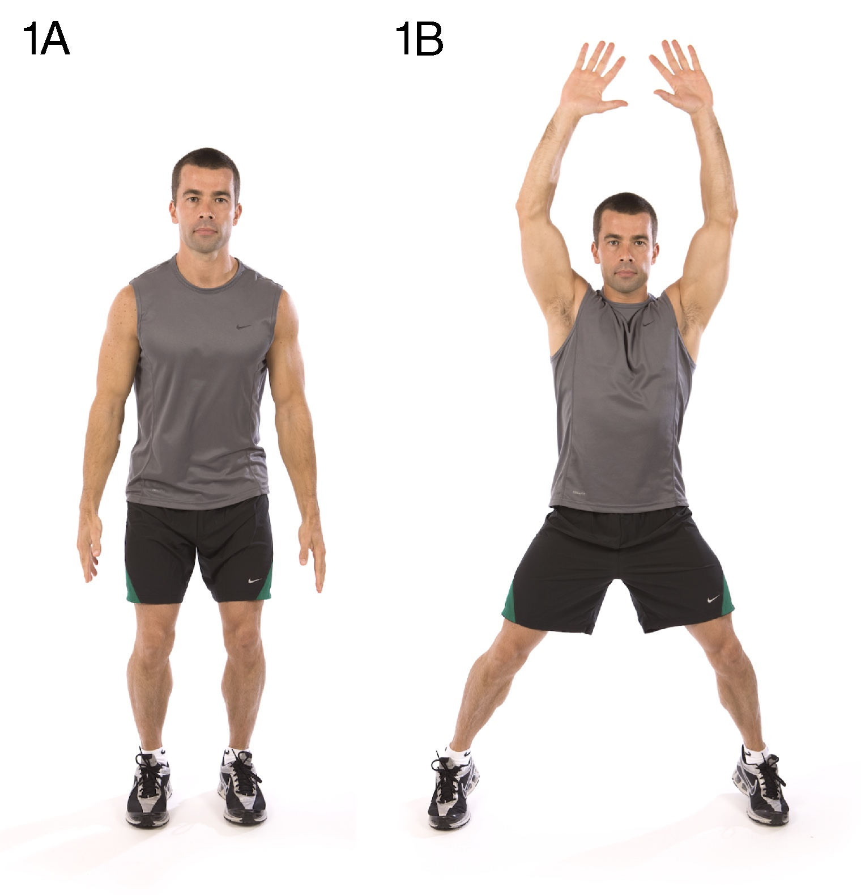

#### 2. Wall sit — Lower body

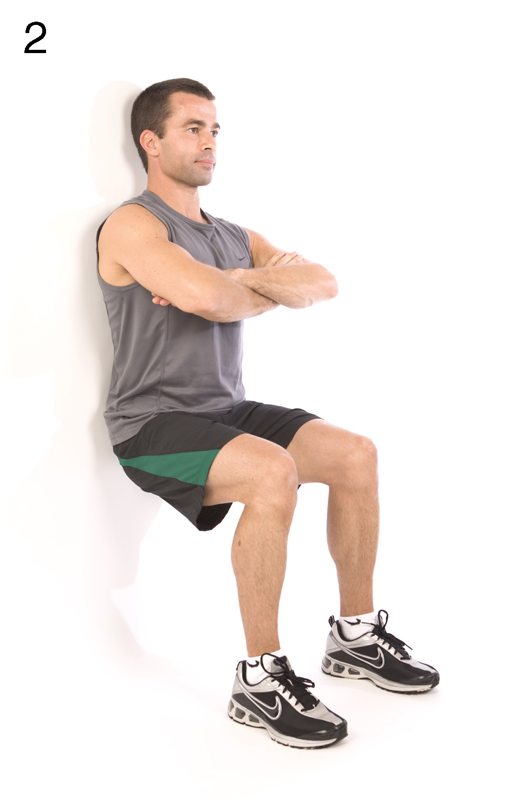

#### 3. Push-up — Upper body

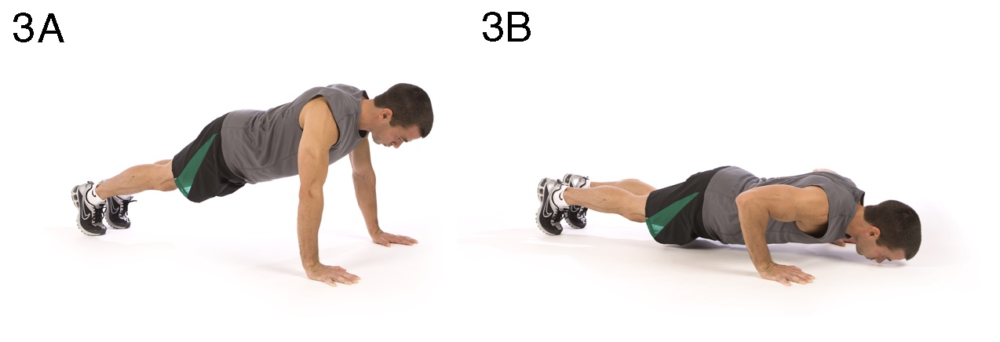

#### 4. Abdominal crunch — Core

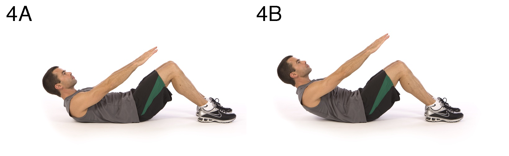

#### 5. Step-up onto chair — Total body

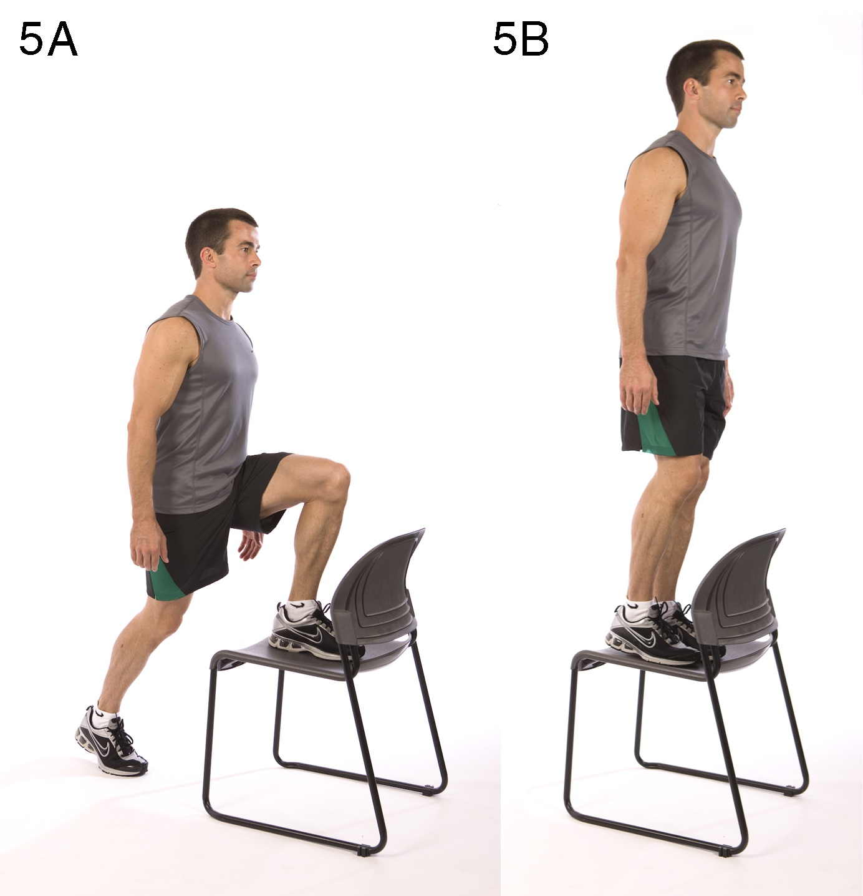

#### 6. Squat — Lower body

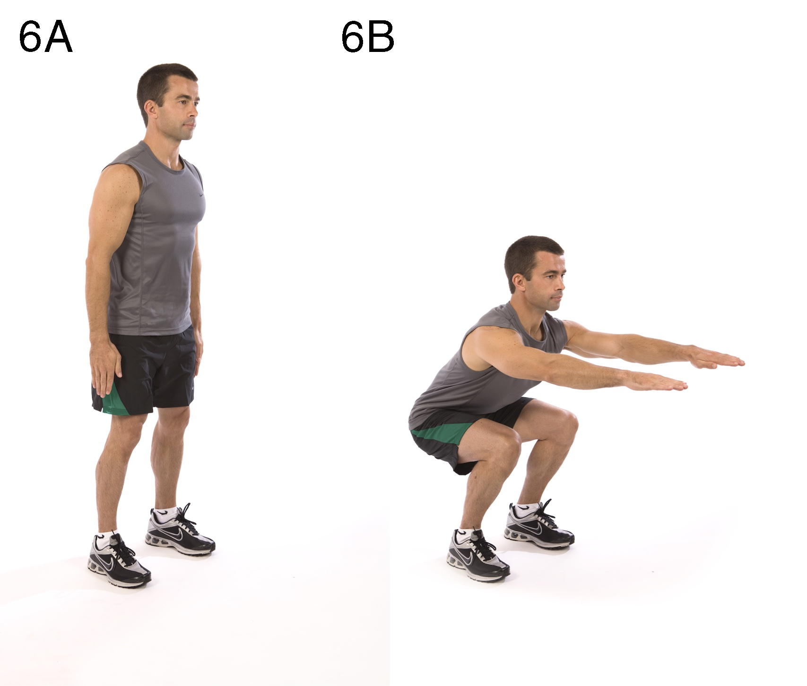

#### 7. Triceps dip on chair — Upper body

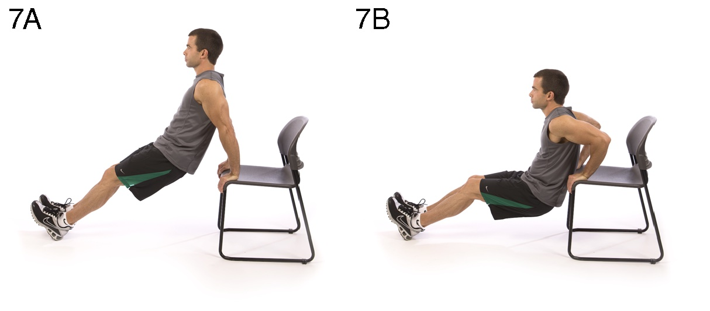

#### 8. Plank — Core

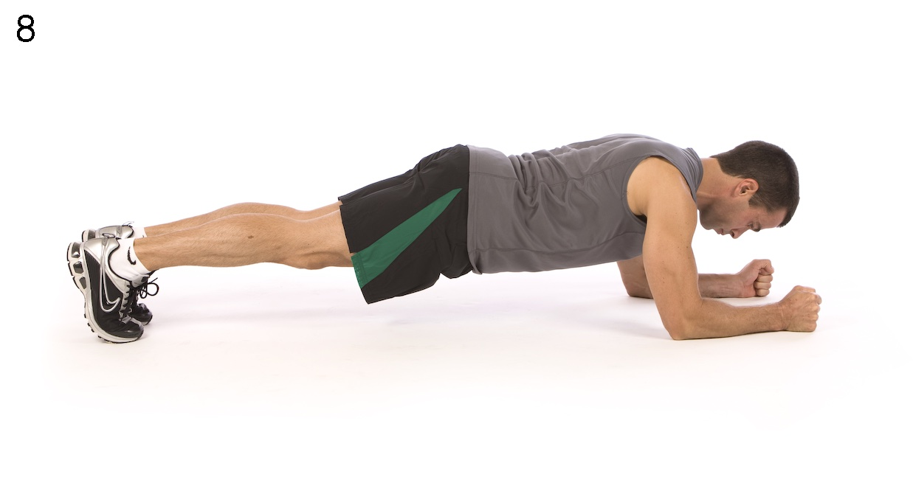

#### 9. High knees/running in place — Total body

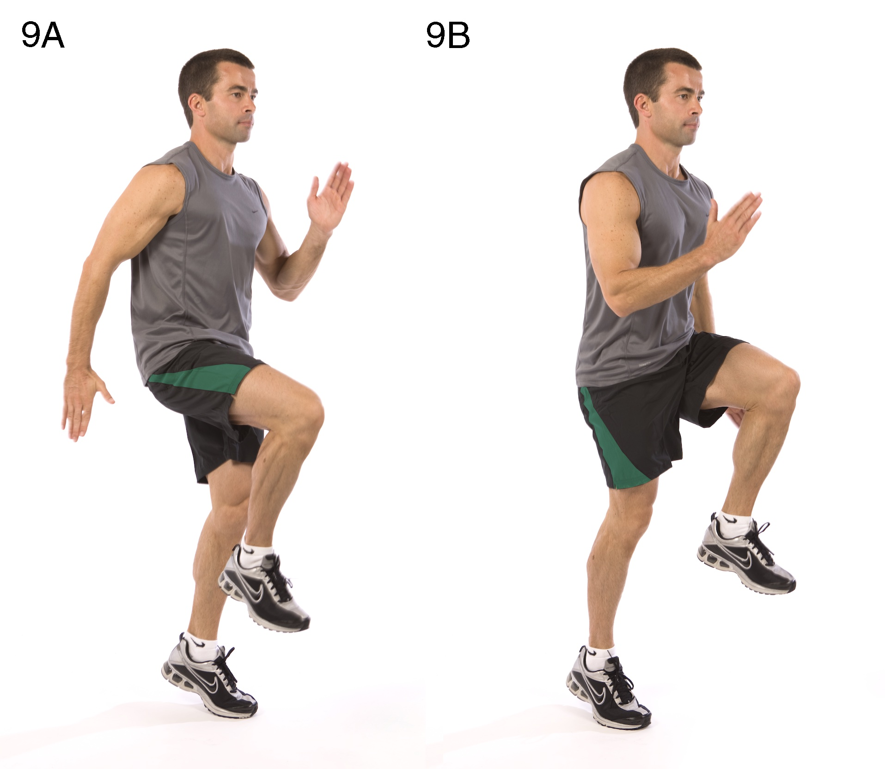

#### 10. Lunge — Lower body

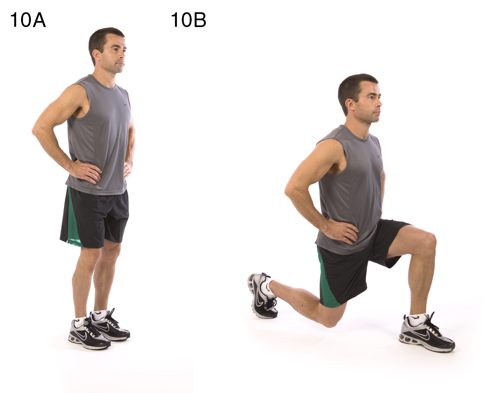

#### 11. Push-up and rotation — Upper body

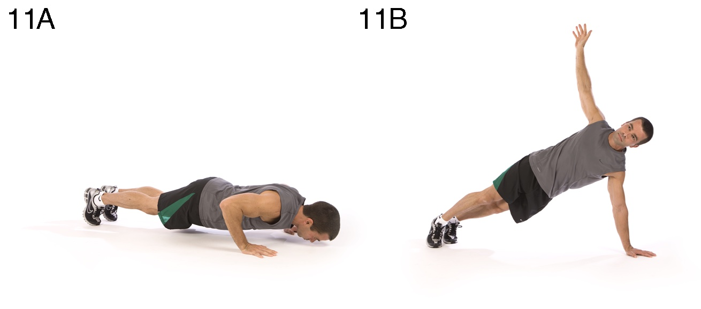

#### 12. Side plank — Core

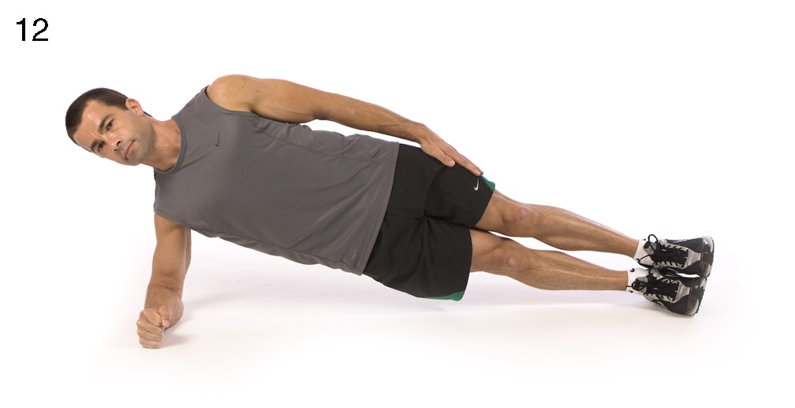

## Summary

HICT seems to be an efficient means of exercise to help decrease body fat, improve insulin sensitivity, and improve
V̇O₂max and muscular fitness. As the hectic pace of today's corporate world continues to infringe on the amount of time
individuals have for exercise, these types of programs can offer a good option to help busy individuals improve their
health and recover from stress via exercise.

The practicality and accessibility of HICT using body weight as resistance makes this exercise program a viable option
for the masses. Individuals who previously believed that they did not have the time for exercise can now trade total
exercise time for total exercise effort and get similar or better health and fitness benefits.

## Condensed Version & Bottom Line

Time and access to facility constraints can be a concern when it comes to getting people to exercise. High-intensity
circuit training seems to deliver numerous health benefits (3, 4, 5, 6, 8, 12, 16, 17) in less time than more
traditional programs that are recommended. Furthermore, body weight can be used as resistance, eliminating the need for
specialized facilities or equipment.

## References

1. Clark MA, Lucett S, Corn R, _et al_. _Optimum Performance Training for the Health and Fitness Professional_. 2nd ed.
   Calabasas (CA): National Academy of Sports Medicine. 2004. 201 p.
2. Elliot DL, Goldberg L, Kuehl KS. Effects of resistance training on excess post-exercise O₂ consumption. _J Appl
   Sports Sci Res_. 1992;6:77–81.
3. Garber CE, Blissmer B, Deschenes MR, _et al_. Quantity and quality of exercise for developing and maintaining
   cardiorespiratory, musculoskeletal, and neuromotor fitness in apparently healthy adults: guidance for prescribing
   exercise. _Med Sci Sports Exerc_. 2011;43(7):1334–59.
4. Gibala MJ, Little JP. Just HIT it! A time-efficient exercise strategy to improve muscle insulin sensitivity. _J
   Physiol_. 2010;588(18):3341–2.
5. Gibala MJ, Little JP, Essen MV, _et al_. Short-term sprint interval versus traditional endurance training: similar
   initial adaptations in human skeletal muscle and exercise performance. _J Physiol_. 2006;575(3):901–11.
6. Haltom R, Kraemer RR, Sloan RA, Frank K, Tryniecki JL. Circuit weight training and its effects on excess postexercise
   oxygen consumption. _Med Sci Sports Exerc_. 1999;31:1202–7.
7. Heden L, Lox C, Rose P, Reid S, Kirk EP. One set resistance training elevates energy expenditure for 72 hours similar
   to three sets. _Eur J Appl Physiol_. 2011;111(3):477–84.
8. Kravitz L. The fitness professional's complete guide to circuits and intervals. _IDEA Today_. 1996;14(1):32–43.
9. Laforgia J, Withers RT, Gore CJ. Effects of exercise intensity and duration on the excess post-exercise oxygen
   consumption. _J Sports Sci_. 2006;24(12):1247–64.
10. Little JP, Safdar A, Wilkin GP, Ranopolsky MA, Gibala MJ. A practical model of low-volume high-intensity interval
    training induces mitochondrial biogenesis in human skeletal muscle: potential mechanisms. _J Physiol_.
    2010;588:1011–22.
11. Moller N, Schmitz O, Porksen N, Moller J, Jorgenson JO. Dose-response studies on the metabolic effects of a growth
    hormone pulse in humans. _Metabolism_. 1992;41(2):172–5.
12. Murphy E, Schwarzkopf R. Effects of standard set and circuit weight training on excess post-exercise oxygen
    consumption. _J Strength Cond Res_. 1992;6(2):66–124.
13. Perry C, Heigenhauser G, Bonen A, Spriet L. High-intensity aerobic interval training increases fat and carbohydrate
    metabolic capacities in human skeletal muscle. _Appl Physiol Nutr Metab_. 2008;33(6):1112–23.
14. Richards JC, Johsnon TK, Kuzma JN, Lonac MC, Schweder MM, Voyles WF, Bell C. _J Physiol_. 2010;588:2961–72.
15. Scott CB, Leighton BH, Ahearn KJ, McManus JJ. Aerobic, anaerobic, and excess postexercise oxygen consumption energy
    expenditure of muscular endurance and strength: 1-set of bench press to muscular fatigue. _J Strength Cond Res_.
    2011;25(4):903–8.
16. Tabata I, Nishimura K, Kouzaki M, _et al_. Effects of moderate-intensity endurance and high-intensity intermittent
    training on anaerobic capacity and VO₂max. _Med Sci Sports Exerc_. 996;28(10):1327–30.
17. Trapp EG, Chisholm DJ, Fruend J, Bouthcher SH. The effects of high-intensity intermittent exercise training on fat
    loss and fasting insulin levels of young women. _Int J Obes_. 2008;32(4):684–91.
18. Wernbom M, Augustsson J, Thomee R. The influence of frequency, intensity, volume and mode of strength training on
    whole muscle cross-sectional area in humans. _Sports Med_. 2007;37(3):225–64.

**Disclosure:** The authors declare no conflict of interest and do not have any financial disclosures.

## About the Authors

**Brett Klika, C.S.C.S., B.S.**, is a performance coach for the Human Performance Institute in Orlando, FL. He
facilitates exercise and movement strategies for high-performing clientele – from professional athletes to corporate
executives.

**Chris Jordan, M.S., C.S.C.S, NSCA-CPT, ACSM HFS/APT**, is the director of Exercise Physiology at the Human Performance
Institute in Orlando, FL. He designed and implemented the exercise and movement components of the Institute's Corporate
Athlete® Course and is responsible for the development and execution of all corporate fitness programming.

---

Copyright © 2013 American College of Sports Medicine. Unauthorized reproduction of this article is prohibited.
